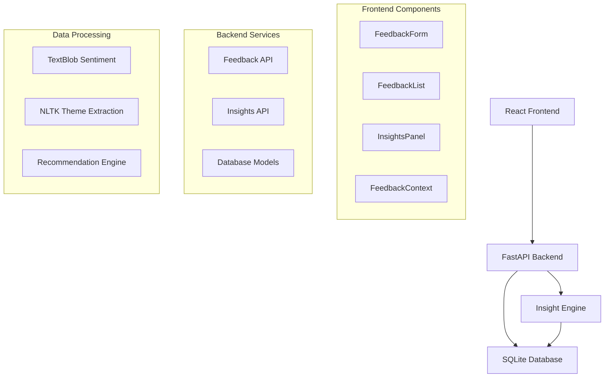
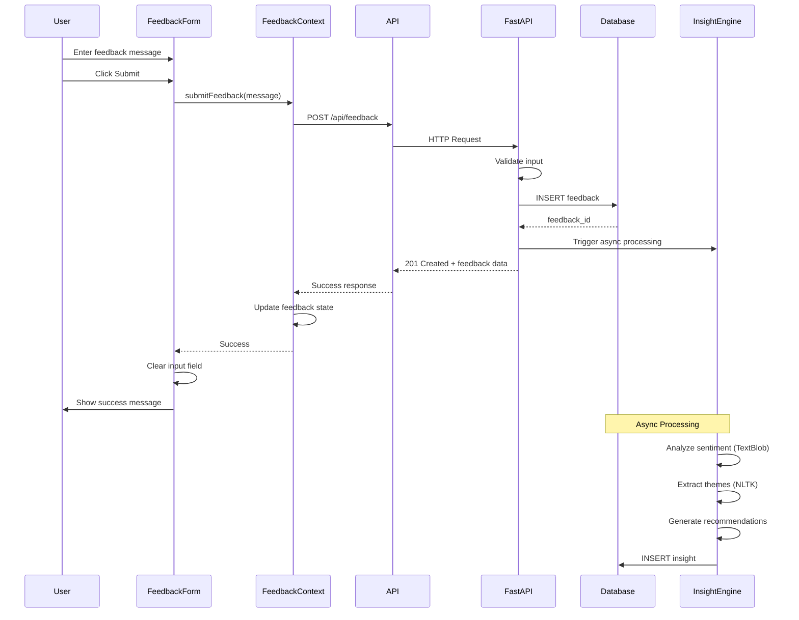
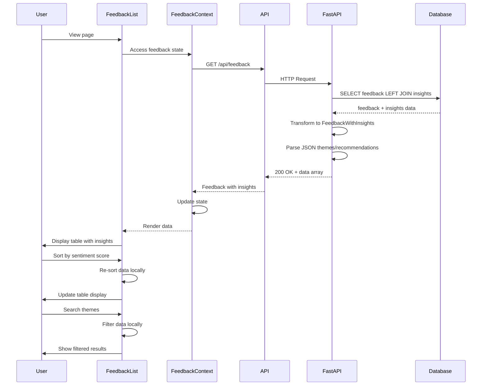
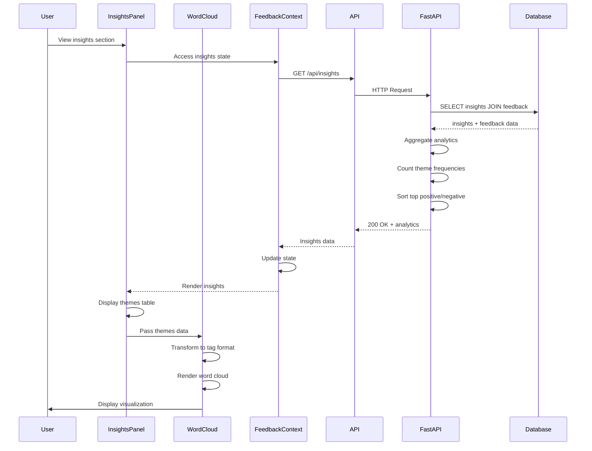
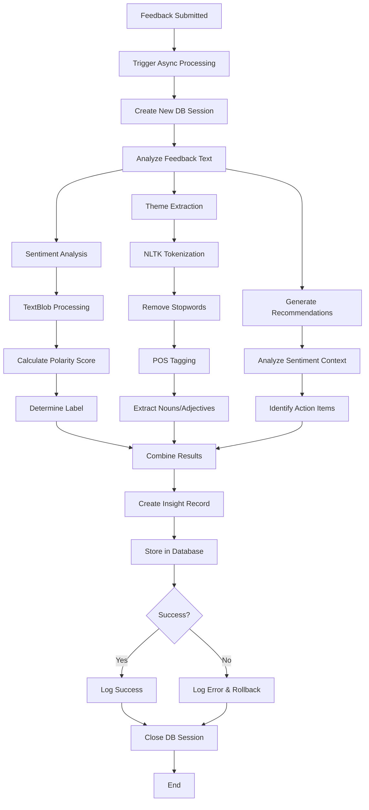
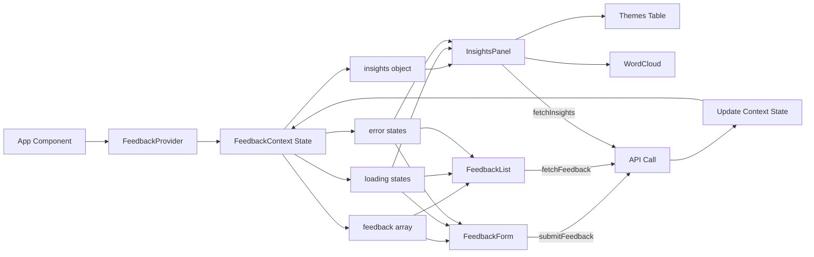
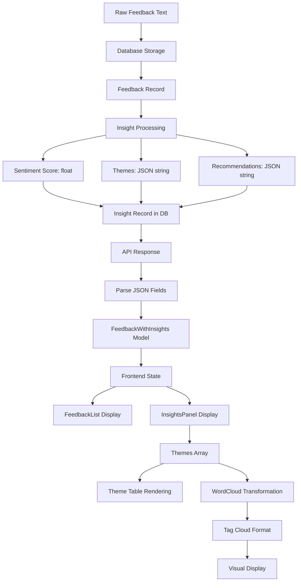

# Design Document

## Overview

The Feedback Insights Platform is a simple POC that enables users to submit feedback and automatically generates AI-powered insights. The system follows a straightforward client-server architecture with React frontend, FastAPI backend, SQLite database, and asynchronous insight processing.

**Key Design Principles:**
- Speed to launch over performance optimization
- Simple, maintainable code structure
- Minimal dependencies and complexity
- Asynchronous processing for insights
- RESTful API design

## Architecture



## Code Flow Diagrams

### 1. Feedback Submission Flow



### 2. Feedback Display Flow



### 3. Insights Display Flow



### 4. Insight Processing Pipeline Flow



### 5. Component State Management Flow



### 6. Data Transformation Flow



## Components and Interfaces

### Frontend Components

**FeedbackForm Component**
- Handles user input for feedback submission
- Manages form state and validation
- Calls POST /api/feedback endpoint
- Provides user feedback on submission status

**FeedbackList Component**
- Displays all submitted feedback messages
- Fetches data from GET /api/feedback endpoint
- Updates automatically when new feedback is submitted
- Shows timestamp and message content

**InsightsPanel Component**
- Displays AI-generated insights and analytics
- Fetches data from GET /api/insights endpoint
- Shows top positive/negative sentiments
- Displays themes table and recommendations

**FeedbackContext Provider**
- Manages global state for feedback and insights
- Provides shared state across components
- Handles API calls and state updates
- Manages loading and error states

### Backend Services

**Feedback API Service**
- POST /api/feedback: Accept and persist feedback
- GET /api/feedback: Retrieve all feedback messages
- Triggers asynchronous insight generation
- Returns appropriate HTTP status codes

**Insights API Service**
- GET /api/insights: Retrieve processed insights
- Returns aggregated analytics data
- Handles cases where insights are not yet available

**Database Service**
- SQLAlchemy ORM for database operations
- Automatic table creation on startup
- Transaction management for data consistency

### Insight Processing Engine

**Sentiment Analysis Module**
- Uses TextBlob for sentiment scoring (-1 to 1 range)
- Processes feedback text for emotional tone
- Stores sentiment scores with feedback reference

**Theme Extraction Module**
- Uses NLTK for text processing and tokenization
- Extracts key topics and themes from feedback
- Counts theme frequency across all feedback

**Recommendation Engine**
- Generates actionable recommendations based on sentiment and themes
- Simple rule-based approach for POC
- Stores recommendations linked to feedback patterns

## Data Models

### Feedback Table
```python
class Feedback(Base):
    __tablename__ = "feedback"
    
    id: int (Primary Key, Auto-increment)
    message: str (Text content)
    timestamp: datetime (Submission time)
    created_at: datetime (Record creation)
```

### Insights Table
```python
class Insight(Base):
    __tablename__ = "insights"
    
    id: int (Primary Key, Auto-increment)
    feedback_id: int (Foreign Key to Feedback)
    sentiment_score: float (-1 to 1 range)
    sentiment_label: str (positive/negative/neutral)
    themes: str (JSON array of extracted themes)
    recommendations: str (JSON array of suggestions)
    processed_at: datetime (Processing timestamp)
```

### API Response Models
```python
# Feedback Response
{
    "id": int,
    "message": str,
    "timestamp": str,
    "created_at": str
}

# Insights Analytics Response
{
    "top_positive": [
        {
            "feedback": str,
            "sentiment_score": float,
            "timestamp": str
        }
    ],
    "top_negative": [...],
    "themes": [
        {
            "theme": str,
            "count": int
        }
    ],
    "recommendations": [
        {
            "recommendation": str,
            "priority": str
        }
    ]
}
```

## Correctness Properties

*A property is a characteristic or behavior that should hold true across all valid executions of a system-essentially, a formal statement about what the system should do. Properties serve as the bridge between human-readable specifications and machine-verifiable correctness guarantees.*

### Property Reflection

After analyzing all acceptance criteria, several properties can be consolidated to eliminate redundancy:
- Feedback storage and retrieval properties can be combined into comprehensive data persistence properties
- API endpoint properties can be unified into general API contract properties  
- UI display properties can be grouped by component functionality
- Insight generation properties can be consolidated into processing pipeline properties

### Core System Properties

**Property 1: Feedback persistence round-trip**
*For any* valid feedback message, submitting it through the API should result in the message being retrievable with correct content, timestamp, and unique identifier
**Validates: Requirements 1.1, 2.2, 2.3, 2.4**

**Property 2: UI feedback submission workflow**
*For any* successful feedback submission, the UI should clear the input field and show confirmation, while failed submissions should display errors and retain input
**Validates: Requirements 1.2, 1.3**

**Property 3: Feedback length acceptance**
*For any* feedback message within reasonable length limits, the system should accept and process it without authentication requirements
**Validates: Requirements 1.4**

**Property 4: Real-time UI updates**
*For any* new feedback or insight data, the UI components should update automatically without requiring manual refresh
**Validates: Requirements 3.2, 6.5**

**Property 5: Insight generation pipeline**
*For any* persisted feedback, the system should trigger asynchronous insight processing that generates sentiment scores, themes, and recommendations linked to the original feedback
**Validates: Requirements 4.1, 4.2, 4.3, 4.4, 4.5**

**Property 6: Insight data persistence**
*For any* generated insights, all components (sentiment scores, themes, recommendations) should be stored in the database with proper references to original feedback
**Validates: Requirements 5.1, 5.2**

**Property 7: Insight analytics display**
*For any* set of processed insights, the UI should correctly display top 5 positive/negative sentiments, theme frequency counts, and actionable recommendations
**Validates: Requirements 6.1, 6.2, 6.3, 6.4**

**Property 8: API contract compliance**
*For any* API request, the system should return appropriate HTTP status codes, JSON-formatted responses, and handle errors gracefully
**Validates: Requirements 8.1, 8.2, 8.3, 8.4, 8.5**

**Property 9: Error handling resilience**
*For any* system failure (insight processing, API errors), the system should handle errors gracefully without corrupting data or breaking user experience
**Validates: Requirements 5.4**

## Error Handling

### Frontend Error Handling
- **Network Errors**: Display user-friendly messages for API failures
- **Validation Errors**: Show inline validation for form inputs
- **Loading States**: Provide visual feedback during API calls
- **Graceful Degradation**: Handle missing or delayed insight data

### Backend Error Handling
- **Database Errors**: Log errors and return appropriate HTTP status codes
- **Insight Processing Failures**: Continue system operation, mark insights as failed
- **Input Validation**: Validate and sanitize all user inputs
- **Async Processing Errors**: Implement retry logic for insight generation

### Data Integrity
- **Transaction Management**: Use database transactions for data consistency
- **Foreign Key Constraints**: Ensure insights properly reference feedback
- **Null Handling**: Handle cases where insights are not yet available
- **Concurrent Access**: Handle multiple users submitting feedback simultaneously

## Testing Strategy

### Dual Testing Approach
The system will use both unit tests and property-based tests for comprehensive coverage:

**Unit Tests** focus on:
- Specific examples and edge cases
- Component integration points
- Error conditions and boundary values
- API endpoint functionality with known inputs

**Property-Based Tests** focus on:
- Universal properties across all inputs
- Comprehensive input coverage through randomization
- System behavior with generated test data
- End-to-end workflow validation

### Property-Based Testing Configuration
- **Framework**: Hypothesis for Python backend, fast-check for JavaScript frontend
- **Iterations**: Minimum 100 iterations per property test
- **Test Tags**: Each property test references its design document property
- **Tag Format**: **Feature: feedback-insights-platform, Property {number}: {property_text}**

### Testing Priorities
1. **Core Functionality**: Feedback submission and retrieval workflows
2. **Data Integrity**: Database operations and referential integrity
3. **Insight Processing**: AI pipeline functionality and error handling
4. **API Contracts**: Request/response formats and error codes
5. **UI Behavior**: Component state management and user interactions

### Test Data Strategy
- **Generated Feedback**: Random text of varying lengths and content
- **Sentiment Scenarios**: Text with known positive/negative sentiment
- **Edge Cases**: Empty inputs, special characters, very long text
- **Error Simulation**: Network failures, database errors, processing timeouts